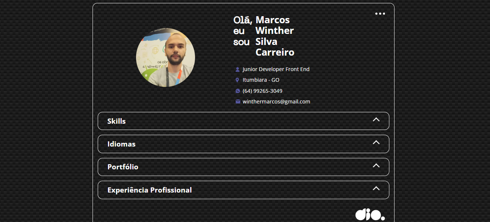

## 👨‍💻 Desafio de Projeto: Portfólio com HTML, CSS e JS
Este projeto de Portfólio com HTML, CSS e JS foi proposto pelo expert Renan Johansen no desafio de projeto da Formação JavaScript Developer da DIO. 
Nesse projeto coloquei minhas informações profissionais e alguns projetos em destaque do meu repositório do GitHUb.

## 💻 Tecnologias usadas

  
  
  

## 🖥 Preview:

Site em um Desktop:

  

 

Site em um dispositivo menor, como por exemplo um celular:

  

- Venha ver como ficou o projeto acessando [aqui nesse link do GithubPages](https://marcoswinther.github.io/project-portfolio-html-css-js/)

## ⚙ Execução desse projeto:
1. **Clonar Repósitório:** basta utilizar o comando `git clone` para clonar esse projeto e salvar na máquina e depois executar o arquivo `index.html`.
2. **GitHubPages:** pode também acessar o projeto nesse [link](https://marcoswinther.github.io/project-portfolio-html-css-js/), que abrirá esse projeto no GitHubPages, sem precisar baixar o repositório na sua máquina.

## 🤔 O que foi feito de diferente nesse projeto:
- O fundo do projeto utilizei CSS Paterns do site [CSS3 Patterns Gallery](https://projects.verou.me/css3patterns/);
- Coloquei minhas informações de contato e profissionais, idiomas, cursos e projetos do meu GitHub.

## 📌 Créditos
- **Assets:** Disponível no protótipo do Figma disponibilizado no curso.
- **CSS Patterns:** Disponível no site [CSS3 Patterns Gallery](https://projects.verou.me/css3patterns/)
